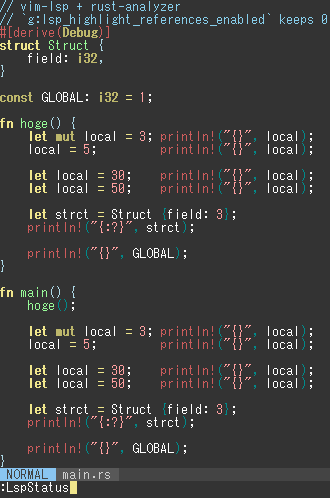
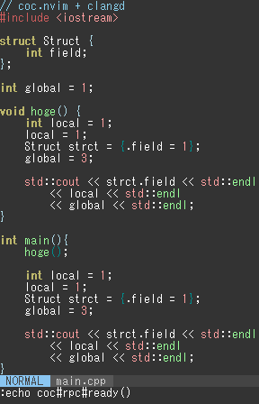
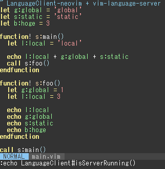

# vim-highlight-references

Auto highlight the references symbol via the lsp plugin.

# Demo

Rust/C++/Vim Script






# Installing

For [vim-plug](https://github.com/junegunn/vim-plug), or 

```vim
Plug 'wordijp/vim-highlight-references'
```

# Support lsp plugins

- [vim-lsp](https://github.com/prabirshrestha/vim-lsp)
- [coc.nvim](https://github.com/neoclide/coc.nvim)
- [LanguageClient-neovim](https://github.com/autozimu/LanguageClient-neovim)


*vim-lsp already has same function, if `g:lsp_highlight_references_enabled` is enabled, run vim-lsp side only.*

# Usage

Update interval after cursor movement is `g:highlight_references_interval` variable.

```vim
" default: 200
let g:highlight_references_interval = 100
```

# License

MIT
